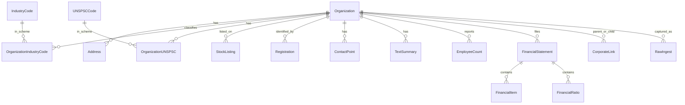

# ERD (Mermaid)

```mermaid
erDiagram
  Organization ||--o{ Address : has
  Organization ||--o{ OrganizationIndustryCode : classifies
  IndustryCode ||--o{ OrganizationIndustryCode : in_scheme
  Organization ||--o{ OrganizationUNSPSC : has
  UNSPSCCode ||--o{ OrganizationUNSPSC : in_scheme
  Organization ||--o{ StockListing : listed_on
  Organization ||--o{ Registration : identified_by
  Organization ||--o{ ContactPoint : has
  Organization ||--o{ TextSummary : has
  Organization ||--o{ EmployeeCount : reports
  Organization ||--o{ FinancialStatement : files
  FinancialStatement ||--o{ FinancialItem : contains
  FinancialStatement ||--o{ FinancialRatio : contains
  Organization ||--o{ CorporateLink : parent_or_child
  Organization ||--o{ RawIngest : captured_as
```
