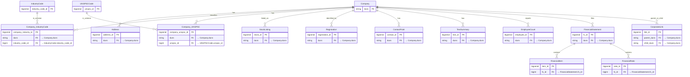

# ERD (Mermaid)

```mermaid
erDiagram
  %% Relationships (as provided)
  Company ||--o{ Address : has
  Company ||--o{ Company_IndustryCode : classifies
  Company ||--o{ Company_UNSPSC : has
  IndustryCode ||--o{ Company_IndustryCode : in_scheme
  UNSPSCCode ||--o{ Company_UNSPSC : in_scheme
  Company ||--o{ StockListing : listed_on
  Company ||--o{ Registration : identified_by
  Company ||--o{ ContactPoint : has
  Company ||--o{ TextSummary : has
  Company ||--o{ EmployeeCount : reports
  Company  ||--o{ FinancialStatement : files
  FinancialStatement ||--o{ FinancialItem : contains
  FinancialStatement ||--o{ FinancialRatio : contains
  Company  ||--o{ CorporateLink : parent_or_child

  %% Entities with PKs/FKs only
  Company {
    string duns PK
  }

  Address {
    bigserial address_id PK
    string duns FK  "→ Company.duns"
  }

  Company_IndustryCode {
    bigserial company_industry_id PK
    string duns FK              "→ Company.duns"
    bigint industry_code_id FK  "→ IndustryCode.industry_code_id"
  }

  IndustryCode {
    bigserial industry_code_id PK
  }

  Company_UNSPSC {
    bigserial company_unspsc_id PK
    string duns FK       "→ Company.duns"
    bigint unspsc_id FK  "→ UNSPSCCode.unspsc_id"
  }

  UNSPSCCode {
    bigserial unspsc_id PK
  }

  StockListing {
    bigserial stock_id PK
    string duns FK  "→ Company.duns"
  }

  Registration {
    bigserial registration_id PK
    string duns FK  "→ Company.duns"
  }

  ContactPoint {
    bigserial contact_id PK
    string duns FK  "→ Company.duns"
  }

  TextSummary {
    bigserial text_id PK
    string duns FK  "→ Company.duns"
  }

  EmployeeCount {
    bigserial employee_id PK
    string duns FK  "→ Company.duns"
  }

  FinancialStatement {
    bigserial fs_id PK
    string duns FK  "→ Company.duns"
  }

  FinancialItem {
    bigserial item_id PK
    bigint fs_id FK  "→ FinancialStatement.fs_id"
  }

  FinancialRatio {
    bigserial ratio_id PK
    bigint fs_id FK  "→ FinancialStatement.fs_id"
  }

  CorporateLink {
    bigserial link_id PK
    string parent_duns FK  "→ Company.duns"
    string child_duns  FK  "→ Company.duns"
  }
```
